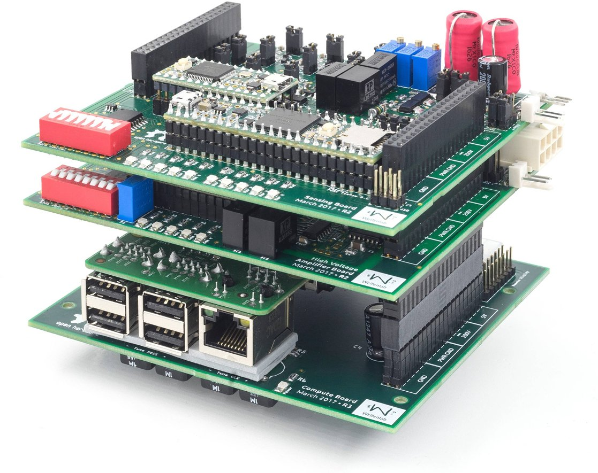

# SCRATCHy  
The *SCalable Reference Architecture for a Tactile display Control Hardware*

SCRATCHy is an open hardware- and software-plattform for controlling so-called "tactile Displays", i. e. devices that are intended to stimulate the touch sensitive receptors in human skin. In combination with [ITCHy](https://github.com/OpenTactile/ITCHy), the tactile mouse, this project forms a complete research environment for e. g. developing new models controlling tactile displays or for conducting user studies.

This repository contains the following parts that reflect the folder structure:
  * `./pcb/` &rarr; Schematics and layouts for printed circuit boards
  * `./libSCRATCHy/` &rarr; Library to access the Signal Generators and peripherals
  * `./SCRATCHPy/` &rarr; Python wrapper covering the high-level functionality of libSCRATCHy
  * `./examplesCpp/` &rarr; Example programs using the C++ interface
  * `./examplesPython/` &rarr; Example programs using the Python interface

There are still some parts missing that are currently under development and will be available soon:
  * Signal Generator firmware
  * *ScratchyShow* graphical interface to libSCRATCHy ([separate respository](https://github.com/OpenTactile/ScratchyShow))
  * [Raspberry Pi 3](https://www.raspberrypi.org/products/raspberry-pi-3-model-b/) compatible SD Card image (will be hosted in separate repository due to its size)

## Assembling the hardware system
The circuit boards located in the `./pcb/` folder have been designed with [Fritzing](http://fritzing.org/home/), an open source EDA software. For convenience, production ready [Extended Gerber](https://en.wikipedia.org/wiki/Gerber_format) files can be found in their respective subfolders.

Since most of the parts on the PCBs come in SMD packages, some experience in soldering such small parts is beneficial. However, the smallest components used here (0805 Package) can still be soldered by hand easily. (There are some nice [tutorial videos](https://www.youtube.com/watch?v=b9FC9fAlfQE) on how to solder SMD components by hand.)

Each of the PCB subfolders contains a Bill Of Material (BOM) listing the components required for a single board. The part numbers given in these lists can be looked up on [Farnell/Newark](http://www.farnell.com/).

#### System overview

The hardware system consists of a single main processor and several so-called *Signal Generators* (SGs) that are connected to a custom SPI/I²C bus. Each of these SGs is able to generate up to 4 indepentent analog signals. Depending of the type of SG, these signals can be amplified externally or are amplified onboard to up to &plusmn;200 V (theoretically, has been tested with 120V).

###### MainComputeUnit
The whole system builds upon the *MainComputeUnit* (MCU) that hosts a Raspberri Pi 3. This linux based computer is intended to generate - depending on e.g. position and velocity of the [Tactile Mouse](https://github.com/OpenTactile/ITCHy) - a rather abstract signal specification for each actuator of the tactile display that is distributed across the SPI bus. Finally, the connected SGs generate a continuous waveform that can be further amplified or processed.

The PCB exposes various GPIO pins as well as SPI and I²C ports of the Raspberry Pi 3 to a common data-bus. Additionally, the DisplayBreaktout board can be connected using a separate plug. This PCB also acts as a pedestal for other modules that can simply be stacked on top.  It can be fixated with four M3 screws.

###### DisplayBreakout
This optional PCB hosts a small graphical [OLED display](https://www.adafruit.com/product/931) as well as some tactile switches that can be accessed via ``libSCRATCHy``. It is connected to the MCU via I²C (and some GPIO pins used for the buttons). Since the Raspberry Pi 3 can connect via HDMI to an external monitor, this board is completely optional.

###### AnalogSignalGenerator
The AnalogSignalGenerator (ASG) contains two Signal Generators within one PCB and is therefore able to generate 8 analog output signals simultaneously. The control data sent from the MCU is interpreted using a custom software running on a [Teensy 3.2](https://www.pjrc.com/store/teensy32.html) USB development board and the resulting time-varying waveform is generated using [PWM](https://en.wikipedia.org/wiki/Pulse-width_modulation). This signal is then lowpass filtered to the frequency range relevant to the mechanoreceptors (0-1000 Hz).

###### HighVoltageAmplifier
The HighVoltageAmplifier (HVA) contains a single Signal Generator as well as a series of [Class-D amplifiers](https://en.wikipedia.org/wiki/Class-D_amplifier) in [H bridge](https://en.wikipedia.org/wiki/H_bridge) topology. Using a separate power supply (ranging from 0 to 200V max.) the PWM signals generated by the Teensy 3.2 are amplified to amplitudes of up to 200V (peak to peak, max.). In combination with a separate passive low pass filter, this signal may be used to drive e. g. piezoelectric actuators directly.

**Working with such high voltages is dangerous! A sufficient casing is needed to prevent accidential contact. Use at your own risk!**
This device has been tested for voltages up to 120 V. Depending on load and voltage, active cooling may be needed.

###### PiezoFilter
This board is needed for low-pass filtering the high voltage signals coming from the HVA. It contains several inductors that form in combination with the capacitivity of the piezoelectric actuators a sufficient filter.

## Programming the Signal Generators

## Building and installing libraries & dependencies

## First steps in using libSCRATCHy

## Interfacing with Python

# License
This project is licensed under the MIT License - see the [LICENSE](LICENSE) file for details
