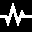

# SCRATCHy  
The *SCalable Reference Architecture for a Tactile display Control Hardware*

SCRATCHy is an open hardware- and software-plattform for controlling so-called "tactile Displays", i. e. devices that are intended to stimulate the touch sensitive receptors in human skin. In combination with [ITCHy](https://github.com/OpenTactile/ITCHy), the tactile mouse, this project forms a complete research environment for e. g. developing new models controlling tactile displays or for conducting user studies.

This repository contains the following parts that reflect the folder structure:
  * `./pcb/` &rarr; Schematics and layouts for printed circuit boards
  * `./libSCRATCHy/` &rarr; Library to access the Signal Generators and peripherals
  * `./SCRATCHPy/` &rarr; Python wrapper covering the high-level functionality of libSCRATCHy
  * `./examplesCpp/` &rarr; Example programs using the C++ interface
  * `./examplesPython/` &rarr; Example programs using the Python interface
  * `./generatorFirmware/` &rarr; Signal Generator "operating system"

## Assembling the hardware system
The circuit boards located in the `./pcb/` folder have been designed with [Fritzing](http://fritzing.org/home/), an open source EDA software. For convenience, production ready [Extended Gerber](https://en.wikipedia.org/wiki/Gerber_format) files can be found in their respective subfolders.

Since most of the parts on the PCBs come in SMD packages, some experience in soldering such small parts is beneficial. However, the smallest components used here (0805 Package) can still be soldered by hand easily. (There are some nice [tutorial videos](https://www.youtube.com/watch?v=b9FC9fAlfQE) on how to solder SMD components by hand.)

Each of the PCB subfolders contains a Bill Of Material (BOM) listing the components required for a single board. The part numbers given in these lists can be looked up on [Farnell/Newark](http://www.farnell.com/).

#### System overview

The hardware system consists of a single main processor and several so-called *Signal Generators* (SGs) that are connected to a custom SPI/I²C bus. Each of these SGs is able to generate up to 4 indepentent analog signals. Depending of the type of SG, these signals can be amplified externally or are amplified onboard to up to &plusmn;200 V (theoretically, has been tested with 120V).

###### MainComputeUnit
The whole system builds upon the *MainComputeUnit* (MCU) that hosts a Raspberri Pi 3. This linux based computer is intended to generate - depending on e.g. position and velocity of the [Tactile Mouse](https://github.com/OpenTactile/ITCHy) - a rather abstract signal specification for each actuator of the tactile display that is distributed across the SPI bus. Finally, the connected SGs generate a continuous waveform that can be further amplified or processed.

The PCB exposes various GPIO pins as well as SPI and I²C ports of the Raspberry Pi 3 to a common data-bus. Additionally, the DisplayBreaktout board can be connected using a separate plug. This PCB also acts as a pedestal for other modules that can simply be stacked on top.  It can be fixated with four M3 screws.

###### DisplayBreakout
This optional PCB hosts a small graphical [OLED display](https://www.adafruit.com/product/931) as well as some tactile switches that can be accessed via ``libSCRATCHy``. It is connected to the MCU via I²C (and some GPIO pins used for the buttons). Since the Raspberry Pi 3 can connect via HDMI to an external monitor, this board is completely optional.

###### AnalogSignalGenerator
The AnalogSignalGenerator (ASG) contains two Signal Generators within one PCB and is therefore able to generate 8 analog output signals simultaneously. The control data sent from the MCU is interpreted using a custom software running on a [Teensy 3.2](https://www.pjrc.com/store/teensy32.html) USB development board and the resulting time-varying waveform is generated using [PWM](https://en.wikipedia.org/wiki/Pulse-width_modulation). This signal is then lowpass filtered to the frequency range relevant to the mechanoreceptors (0-1000 Hz).

###### HighVoltageAmplifier
The HighVoltageAmplifier (HVA) contains a single Signal Generator as well as a series of [Class-D amplifiers](https://en.wikipedia.org/wiki/Class-D_amplifier) in [H bridge](https://en.wikipedia.org/wiki/H_bridge) topology. Using a separate power supply (ranging from 0 to 200V max.) the PWM signals generated by the Teensy 3.2 are amplified to amplitudes of up to 200V (peak to peak, max.). In combination with a separate passive low pass filter, this signal may be used to drive e. g. piezoelectric actuators directly.

**Working with such high voltages is dangerous! A sufficient casing is needed to prevent accidential contact. Use at your own risk!**
This device has been tested for voltages up to 120 V. Depending on load and voltage, active cooling may be needed.


###### PiezoFilter
This board is needed for low-pass filtering the high voltage signals coming from the HVA. It contains several inductors that form in combination with the capacitivity of the piezoelectric actuators a sufficient filter.


## Programming the Signal Generators
Before the Teensy can be flashed, please install Teensyduino by following the [official instructions](https://www.pjrc.com/teensy/td_download.html). Afterwards, building and flashing the firmware is straightforward:

```shell
cd generatorFirmware
make
```
If the build process was successfull, you can install the firmware by connecting the Teensy (separate it from the SG board before!) via USB and running

```shell
make upload
```

## Dependencies
libSCRATCHy requires the following dependencies to be installed:
- [Qt 5.9](https://www.qt.io/)
- [libusb](http://libusb.info/)

If the Raspberry Pi 3 is going to be used for the MCU (recommended), the following libraries need to be installed as well:
- [Wiring Pi](http://wiringpi.com/)
- [libbcm2835](http://www.airspayce.com/mikem/bcm2835/)

SCRATCHPy, the python wrapper for libSCRATCHy, does need two more dependencies:
- Python 3.6m
- [Boost.Python](http://www.boost.org/doc/libs/1_65_1/libs/python/doc/html/index.html)

## Building libSCRATCHy and SCRATCHPy

libSCRATCHy uses the qmake build system and is available for linux platforms only. For building and installing the library system-wide, please follow these steps within the base directory:
```bash
mkdir libSCRATCHy-build
cd libSCRATCHy-build
qmake ../libSCRATCHy
make && sudo make install
```
#### Using *fake mode*
If you intend to use libSCRATCHy on a personal computer (not using the Raspberry Pi 3), you may pass an additional configuration option to qmake that disables some platform specific tests at runtime

```bash
[...]
qmake ../libSCRATCHy CONFIG+=fake
make && sudo make install
```
This also causes the ``iowrap_dummy.cpp`` to be built instead of ``iowrap_raspberry.cpp``. By using *fake mode*, one can make use of the complete SCRATCHy API without triggering any hardware specific actions (e.g. GPIO access, I²C communication, etc.).


## First steps in using libSCRATCHy
The directory `examplesCpp` contains a minimal example project that can be build using qmake:
```bash
mkdir minimalExample-build
cd minimalExample-build
qmake ../examplesCpp/minimalExample
make
./MinimalExample
```
Please make sure that libSCRATCHy as well as libITCHy has been build and installed beforehand.
This application will output a frequency that is scaled with the current movement speed of the tactile mouse.

## Interfacing with Python
A python-based application equivalent to the C++ example can be found in the `examplesPython` directory.
The python script `minimalExample.py` needs the python bindings of libSCRATCHy and libITCHy to be build.
When running
```bash
python minimalExample.py
```
the application should do exactly the same as the C++ example.

In case there are `ModuleNotFoundError` messages, please adjust the lines
```python
sys.path.append(os.path.abspath('../../SCRATCHPy/build/lib.linux-x86_64-3.6/'))
sys.path.append(os.path.abspath('../../../ITCHy/ITCHPy/build/lib.linux-x86_64-3.6/'))
```
to match the actual build-path of the libraries. 

## API Reference
The SCRACTHy API is separated into two categories: High- and Lowlevel functionality.
In the majority of cases, the Highlevel API should be sufficient to control the complete system. In case custom devices have been added to the bus-system, or if the SignalGenerators following a non-standard protocol, the Lowlevel API allows for direct access to GPIO, SPI and I²C.

### Highlevel API

#### GraphicalDisplay
This class allows accessing the (optional) DisplayBreakout by providing convenience functions for displaying icons and text.

##### `bool detach()`
Separates the GraphicalDisplay from the main thread, causing the `show` and `text` methods to be non-blocking.
However, special attention has to be drawn when communication via I²C from a different thread simultaneously.

##### `bool isPressed(Button button)`
Queries if a specific button is pressed *at the moment* of the call.
`Button` may be one of the following values:
- `Button::Back`
- `Button::Up`
- `Button::Down`
- `Button::Select` (The rightmost button on the DisplayBreakout)

##### `void clear()`
Clears the OLED Display causing all pixels to be set to black.

##### `void show(Icon icon, const std::string& header, const std::string& body)`
Renders a default arrangement to the OLED-display consisting of a small 32x32px pictogram on the left, a header text in a slightly larger font and a body text with the default 6x6px font. In case the strings are too long to be displayed they will be truncated.

The following pictograms can be selected:

 `Icon::None`,  `Icon::Scratchy`,  `Icon::Spectrum`,  `Icon::Forbidden`

 `Icon::Bolt`,  `Icon::Bug`,  `Icon::Check`,  `Icon::Clock`

 `Icon::Cog`,  `Icon::Fire`,  `Icon::Image`,  `Icon::Reboot`

 `Icon::Power`,  `Icon::Pulse`,  `Icon::Random`,  `Icon::Warning`

 `Icon::Wrench`,  `Icon::X`


##### `void show(Icon icon, const std::string& header, float body)`
This is an overloaded method for quickly showing numerical values without the need for explicit string conversion.

##### `void text(const std::string& text)`
Displays the specified text on the OLED-display. In case the string is too long to be displayed in one line (21 characters) it will be wrapped automatically.

#### SignalManager

##### `bool initializeBoards(unsigned int dacResolution, unsigned int samplingTime)`

##### `std::vector<uint8_t> scanDevices()`

##### `void reset(uint8_t address)`

##### `void reset()`

##### `void initSystem()`

##### `void assignAddresses()`

##### `void gatherSPISpeed()`

##### `void maskDevice(uint8_t address)`

##### `std::vector<SignalGenerator>& generators()`

##### `std::vector<uint8_t> addresses() const`

##### `SignalGenerator& generator(uint8_t address)`

#### SignalGenerator

##### `uint8_t address() const`

##### `SystemStatus status() const`

##### `void resetStatus() const`

##### `bool isAlive()`

##### `void finishR0()`

##### `bool spiCheck(uint16_t divider = 16) const`

##### `void finishR1()`

##### `void setDACResolution(uint8_t resolution)`

##### `void setSamplingRate(uint32_t rate)`

##### `void finishR2()`

##### `void startSignalGeneration() const`

##### `void send(const std::array<FrequencyTable, 4>& data)`

##### `void send(const FrequencyTable& dataABCD)`

##### `void send(const FrequencyTable& dataA, [...], const FrequencyTable& dataD)`

##### `void shutdown()`

#### PositionQuery

##### `virtual QVector2D position() const`

##### `virtual QVector2D velocity() const`

##### `virtual float orientation() const`

##### `virtual float angularVelocity() const`

##### `virtual bool buttonPressed() const`

##### `virtual bool initialize()`

##### `virtual void update()`

##### `virtual void feedback(unsigned char r, unsigned char g, unsigned char b)`

##### ConstantVelocityQuery

##### MousePositionQuery

### Lowlevel API
All lowlevel functions can be accessed via the `iowrap.h` header file. The lowlevel API gives access to platformspecific functionality such as GPIO configuration, direct SPI communication as well as sending custom I²C commands to the SignalBoards.

#### GPIO

##### `void GPIOSetDirection(unsigned int pin, GPIODirection direction)`

##### `void GPIOHigh(unsigned int pin)`

##### `void GPIOLow(unsigned int pin)`

##### `bool GPIOIsLow(unsigned int pin)`

##### `bool GPIOIsHigh(unsigned int pin)`

##### `void GPIOInit()`

##### `void GPIOFree()`

##### `void GPIOSetAddress(unsigned int address)`

##### `void GPIOSetBroadCast(bool value)`


#### SPI

##### `void SPIInit()`

##### `void SPIFree()`

##### `void SPISetDivider(unsigned int divider)`

##### `unsigned int SPIGetCurrentSpeed()`

##### `void SPISend(const uint16_t *data, int size)`


#### I²C


##### `void I2CInit()`

##### `void I2CFree()`

##### `bool I2CSetAddress(int address)`

##### `char I2CReadByte(int cmd)`

##### `bool I2CWriteByte(int cmd, unsigned char buffer)`

##### `bool I2CReadBlock(int cmd, uint16_t length, unsigned char *buffer)`

##### `bool I2CWriteBlock(int cmd, uint16_t length, const unsigned char* buffer)`
